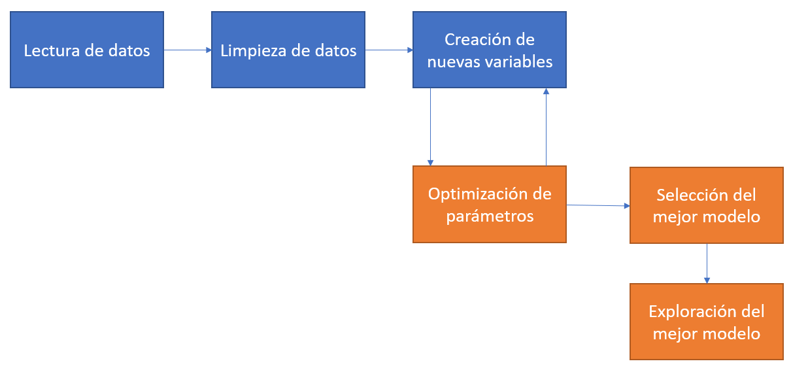

# El ritual del aprendizaje automático (Parte 2)

En el capítulo anterior dejamos pendiente el último tramo en un típico proyecto para predecir o clasificar usando modelos de aprendizaje automático: la **optimización de parámetros y selección de modelo**. Esta parte suele consistir en establecer uno o más **criterios de selección** y probar distintas combinaciones de parámetros de nuestros modelos para ver cuál es el que mejor predice **nuevos datos**. Adicionalmente, vamos a investigar un poco cómo podemos obtener información sobre las variables más importante para los modelos.

Para este capítulo vamos a usar las funciones de los paquetes que componen **tidymodels**, que buscan simplificar muchas etapas de este último paso de optimización de parámetros y selección de modelo, aunque también brinda funciones para incoporporar el resto de las etapas que estuvimos haciendo en el capítulo anterior. Ya quedará todo más claro hacia el final de este capítulo.

La figura que se muestra debajo de este párrafo muestra, en naranja, las tareas que haremos en este capítulo y que completan una parte muy importante de un proyecto de ciencia de datos en el cual se usan modelos de aprendizaje automático para tareas de predicción o clasificación. Noten que lo que tenemos que hacer es optimizar los parámetros y, en base a alguna medida de *performance*, seleccionar el mejor modelo e intentar explorar la importancia de las variables y resumir su capacidad predictiva ¿Ven esas flechas de ida y vuelta entre la creación de nuevas variables y la optimización de los parámetros? Muchas veces creamos nuevas variables o modificamos las existentes para mejorar alguno de los resultados que nos arroja la optimización de los parámetros. En este caso no vamos a hacerlo, pero vale la pena aclararlo.

```{r echo=FALSE}

```

Finalmente, para lo que sigue de este capítulo vamos a tener que tener instalado el paquete **tidymodels** y cargados los datos del capítulo anterior:

```{r message=FALSE}
library(tidyverse)
library(tidymodels)
# Carga de datos
datosCordoba <- read_delim("https://github.com/martinmontane/AnalisisEspacialEnR/raw/master/data/datosMachineLearning2.csv", delim=";") %>% select(-precioM2)
```


## Separando dataset de entrenamiento y de testing

En **tidymodels** podemos separar a los datos en un conjunto de entrenamiento y de testing de una manera muy simple usando la función **initial_split()**. Recuerden que esto es necesario porque nos interesa conocer la capacidad predictiva de nuestros modelos cuando le presentamos datos con los que NO se entrenaron, no sobre aquellos con los que se entrenó. Esto es así porque si seleccionamos un modelo en base a qué tan bien ajusta a los datos con los que entrena podemos caer en el territorio del **overfitting**, es decir, cuando nuestro modelo se aprende "de memoria" los datos y extrae una mala aproximación de la relación que existe entre las variables, haciendo muy malas predicciones **out-of-sample**, es decir en nuevos datos.

```{r}
# Esta primer línea es solo para que separemos los mismos casos en training y testing
set.seed(10)
# Guardamos un 10% de los datos para después de haber entrenado el modelo
cordobaSplit <- initial_split(datosCordoba,prop = 0.7)
```

Con el parámetro **prop** indicamos cuál es la proporción de los datos que queremos que nos quede en el dataset de entrenamiento. En este caso, elegimos que el 70% de todos nuestros datos sean utilizados para entrenar a nuestro modelo de aprendizaje automático. Pueden verlo usando el método de print() de cordobaSplit:

```{r}
cordobaSplit
```

Aunque los nombra un poco distinto, lo que nos dice es que hay 10.653 observaciones para entrenar a nuestro modelo y 4.565 para evaluar su capacidad predictiva sobre nuevos datos. cordobaSplit es un objeto de rsplit, para efectivamente tener a los data.frames podemos usar las funciones training() y testing() que nos generan estos datasets a partir del split. Presten atención al largo de cada uno de estos objetos.

```{r}
cordobaTrain <- training(cordobaSplit)
cordobaTesting <- testing(cordobaSplit)
```


## Nuestra receta y su preparación

En el framework de tidymodels, existen **recetas** (recipes) que escribimos para nuestros modelos. Pueden incluir transformaciones a los datos y formulas de predicción, entre otras cosas. En este caso, ya hicimos toda la transformación en el capítulo anterior, así que lo que vamos a marcar simplemente la fórmula de lo que queremos predecir: el precio de las propiedades. Como siempre, pueden usar el menú de ayuda de R , **?recipe** en este caso, para conocer específicamente lo que podemos incluir en esta función.

```{r}
cordobaRecipe <- recipe(formula = property.price ~.,
                        data=cordobaTrain)
cordobaRecipe
```

Como podemos ver, creamos una "Data Recipe", y lo que nos indica es que existe 1 variable que queremos predecir y 10 predictores. Ahora, debemos indicar que queremos "preparar" esta receta, es decir evaluar si esta receta puede ser aplicada a nuestros datos y dejarla lista para los siguientes pasos.

```{r}
treePrep <- prep(cordobaRecipe)
treePrep
```

## Selección de modelo y espacio de búsqueda de los parámetros

Ahora lo que nos queda para definir es el modelo a estimar, y esto requiere el uso de algunas funciones debido a que existen diversas decisiones que tenemos que hacer. La primera de ellas es básicamente elegir el modelo con el queremos trabajar. Ya hemos aclarado anteriormente que vamos a usar **random forest**, un modelo basado en árboles y **bagging**, es decir la creación de muchos árboles sumamente especializados que luego hacen una predicción conjunta. Podemos elegir este tipo de modelos con **rand_forest()**.

Dentro de esta función podemos especificar los valores de los parámetros y, más importante, aclarar cuales son los que queremos "tunear", es decir, optimizar. Esto lo declaramos con la función **tune()**. En el caso de los random forests, dos de los parámetros que suelen optimizarse son **mtry** y **min_n**. El primero determina la cantidad de variables que, al azar, pueden usarse en cada uno de los nodos de los árboles. Recuerden que random forest no elige a todos los predictores en cada nodo, sino que solo candidatea al azar a una cantidad fija de columnas, y esto es lo que marcamos con **mtry**. Por otro lado, **min_n** establece una cantidad mínima de valores que tiene que haber en un nodo como para poder seguir profundizando el árbol.

Por otro lado, con la función **set_mode()** debemos identificar si queremos hacer una regressión (para predecir valores númericos) o una clasificación (para predecir valores categóricos). Finalmente, en **set_engine** indicamos el paquete que tiene la implementación de random forest. Existen muchas librerías en R para hacerlo, vamos a usar la que brinda el paquete *ranger*

```{r}
tuneSpec <- rand_forest(
  mtry = tune(),
  trees = 1000,
  min_n = tune()
) %>% 
  set_mode("regression") %>% 
  set_engine("ranger")
tuneSpec
```

Ya tenemos la especificación de nuestro modelo. Ahora nos queda establecer un **workflow**, que no es otra cosa que un conjunto de instrucciones secuenciales que hay que hacer para entrenar los modelos. En este caso, le decimos que tome la receta ya preparada que declaramos anteriormente, y luego entrene el modelo que especificamos recién.

```{r}
tuneWf <-workflow() %>% 
  add_recipe(treePrep) %>% 
  add_model(tuneSpec)
tuneWf
```

Ahora lo que vamos a hacer es crear conjuntos de entrenamiento para realizar **cross validation** o validación cruzada. Este concepto que puede sonar complejo es realmente simple. Lo que hacemos es cortar nuestros datos al azar grupos de igual tamaño. Para cada combinación de parámetros, entrenamos el modelo en todos los grupos menos uno, y predecimos sobre el que no entrenamos. Promediamos el valor de todos los errores y ese es el valor por el cual vamos a juzgar la *performance* de nuestro modelo. El gráfico que sigue es muy ilustrativo sobre cómo funciona

```{r echo=FALSE}
knitr::include_graphics("data/kfolds.png")
```

Podemos crear estos grupos, en base a nuestro conjunto de entrenamiento, con la función **vfold_cv()**

```{r}
# Hacemos esto para que tengamos los mismos grupos
set.seed(234)
# Creamos los grupos
trees_folds <- vfold_cv(cordobaTrain, v = 5)
```

Ya casi estamos listos para entrenar los modelos. Lo que nos falta es fundamental: específicar cual es el espacio de búsqueda de nuestros parámetros. Hay muchas formas de hacer esto en **tidymodels**, pero lo que vamos a usar en esta clase es **grid_regular()**. Le pasamos un valor mínimo y máximo de valores posibles para cada uno de los parámetros que queremos optimizar, y luego una cantidad de valores únicos para cada uno de los parámetros. Obviamente, cómo mtry va entre 2 y 8, vamos a tener solo 7 valores, pero en el caso de **min_n** tomára 10 valores espaciados entre 5 y 200. Pueden ver por ustedes mismos la grilla, ya que es simplemente un tibble.

```{r}
rf_grid <- grid_regular(
  mtry(range = c(2,8)),
  min_n(range = c(5,200)),
       levels=10
)
```

## Entrenando los modelos en nuestro espacio de búsqueda

Entrenar 70 modelos con cross validation de 5 grupos implica entrenar 5x70 = 350 modelos... esto puede llevar un buen rato. Usemos al paquete **doParallel** para aprovechar el procesamiento en paralelo en R. Pueden hacerlo simplemente en una línea:

```{r}
doParallel::registerDoParallel()
```

Ahora ya podemos entrenar todos los parámetros de nuestra grilla con la función **tune_grid()**. Lo único que hacemos es pasarle objetos que ya creamos anteriormente. Tengan paciencia cuando corran este código, que puede tardar un rato. 

```{r eval=FALSE}
set.seed(345)
resultadoBusqueda <- tune_grid(
  tuneWf,
  resamples=trees_folds,
  grid=rf_grid
)
```

Como siempre, dejo a disposición el resultado de este proceso para que no tengan que esperar a correrlo para entender qué es lo que hicimos.

```{r}
load("https://github.com/martinmontane/AnalisisEspacialEnR/raw/master/data/resultadoBusqueda.RData")
resultadoBusqueda
```

**resultadoBusqueda** tiene para cada uno de nuestros grupos de cross validation el resultado de RMSE y R2, dos indicadores que pueden ser utilizados para medir la capacidad predicitiva de nuetro modelo. Nosotros necesitamos el promedio de estos grupos, y para eso usaremos **collect_metrics()**

```{r}
metricasPerformance <- collect_metrics(resultadoBusqueda)
glimpse(metricasPerformance)
```

Se trata de un dataset con 140 filas, dado que entrenamos 70 modelos y tenemos 2 indicadores de performance para cada uno de ellos. Refrescemos un poco la memoría sobre qué es lo que hace cada uno de ellos.

Por un lado, la raíz del error cuadrático medio (RMSE, por su sigla en inglés) tiene la siguiente fórmula

$$ \color{#E7298A}{RMSE} = \sqrt{(1/\color{olive}{n})\sum_{i=1}^{\color{olive}{n}}(\color{purple}{y_i} - \color{orange}{\hat{f}(x_i)})^2}=$$

Donde $\color{olive}{n}$ es la cantidad de observaciones, $\color{purple}{y_i}$ es el valor observado para la observación i; y $\color{orange}{\hat{f}(x_i)}$ es el valor predicho dada la aproximación y los valores de las variables para la observación i. En otras palabras, el RMSE es cuanto nos confundimos en promedio al predecir los datos. 

Por otro lado, el R2 o "Rsquared" puede explicitarse de la siguiente manera:

$$ \color{#e41a1c}{R^2} = 1 - \frac{\color{#377eb8}{SS_{res}}} {\color{#4daf4a}{SS_{tot}}} $$,

donde $\color{#377eb8}{SS_{res}}$ es la suma al cuadrado de los residuos, es decir $\color{#377eb8}{SS_{res}} = \sum_{i}^{N}(y_i-\hat{y})^2$: cuanto de la variabilidad queda plara explicar luego de que hacemos la predicción, mientras que $\color{#4daf4a}{SS_{tot}} = \sum_{i}^{N}(y_i-\bar{y})^2$, es decir la diferencia entre el valor observado y el promedio.

Estas son dos de las métricas más utilizadas para seleccionar los modelos. Veamos cómo dan los resultados para la combinación de los parámetros que hemos usado:

```{r}
ggplot(metricasPerformance) +
  geom_point(aes(x=mtry,color=factor(min_n),y=mean)) +
  facet_wrap(~ .metric,scales = "free")
```

En ambos casos podemos ver que el RMSE mínimo y el R2 máximo se alcanzan con los parámetros **min_n = 5** y **mtry = 2**. Además podemos ver que cuanto más aumenta mtry, el modelo empeora, señalando una de las ventajas de random forest. Parece contrar un mínimo cercano al valor 2 o 3.

## Seleccionando el mejor modelo y analizando los resultados

Ya estamos en condiciones de elegir el mejor modelo y medir su capacidad predictiva en el conjunto de testing - o validación, en rigor - que separamos al principio de la clase. Para elegir el mejor modelo tenemos que usar **select_best()**, función a la cual solo tenemos que pasarle el resultado de la búsqueda de parámetros y una métrica para elegir al modelo:

```{r}
select_best(resultadoBusqueda, metric="rmse")
```

Nos dice algo que ya podíamos ver anteriormente, que el mejor modelo dentro de los que buscamos es el que tiene mtry 2 y min_n 5. Veamos si r2 elige al mismo modelo:

```{r}
select_best(resultadoBusqueda, metric="rsq")
```

Ambos criterios eligen exactamente al mismo modelo. Ahora estimamos ese modelo para esos parámetros, será nuestro modelo final con el que probaremos la capacidad predictiva sobre los datos nuevos. Para seleccionar al modelo ganador solo tenemos que usar **finalize_model()**

```{r}
rfWinner <- finalize_model(
  tuneSpec,
  select_best(resultadoBusqueda, metric="rmse")
)
```

Y ya podemos entrenar al modelo con esos parámetros sobre todos los datos de training

```{r}
set.seed(456)
modeloGanador <-rfWinner %>% 
  set_engine("ranger") %>% 
  fit(property.price ~., data=cordobaTrain)
```

Y predecir sobre nuevos datos

```{r}
# R2
rsq_vec(truth =  predict(modeloGanador,new_data = cordobaTesting) %>% pull(.pred),
         estimate = cordobaTesting %>% pull(property.price))
#RMSE
rmse_vec(truth = predict(modeloGanador,new_data = cordobaTesting) %>% pull(.pred),
         estimate = cordobaTesting %>% pull(property.price))
```

## Importancia de las variables

Cerremos este ejercicio teniendo alguna idea de la importancia que tienen cada una de las variables en nuestro modelo ganador. Usemos el paquete **vip** para esta tarea. Fijense que tenemos que elegir el método para elegir la importancia de las variables, algo que está fuera del objetivo de este libro, aunque merece una breve introducción. "Permutation" lo que hace es calcular la contribución promedio de una variable a la capacidad predictiva del modelo comparando el MSE (Mean squared error) obtenido cuando se "mezcla" la variable con respecto al valor cuando se usa como se observa en los datos. La idea es que si una variable no es muy importante, entonces la diferencia en la capacidad predictiva de la variable observada y de la "mezcla" debería ser baja y viceversa.

```{r}
library(vip)
set.seed(456)
modeloGanador <-rfWinner %>% 
  set_engine("ranger", importance="permutation") %>% 
  fit(property.price ~., data=cordobaTrain)
vip(modeloGanador,geom="point")
```

¿Qué observamos? Que la información espacial importa para este modelo. Más allá de que las primeras dos variables más importantes para explicar este modelo son **property.surface_covered** y **property.surface_total**, las variables Y, precioM2Vecino y X son la tercera, cuarta y quinta variable más importantes según esta medida de importancia.

